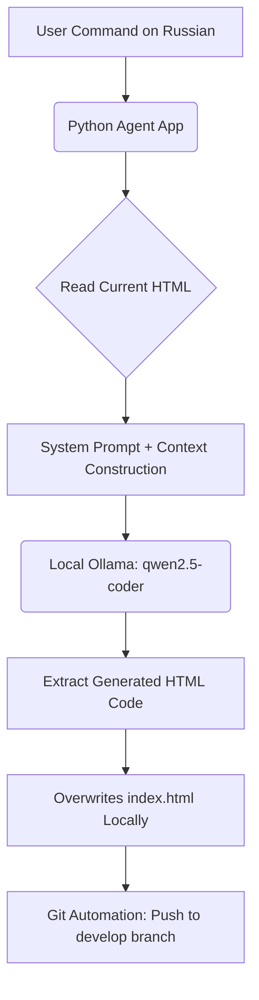

# Moya Elochka (My Christmas Tree) 🎄✨

An interactive, responsive web application for handcrafted Christmas ornaments. The development lifecycle and deployment of this project are fully automated using a **custom, autonomous AI Agent written in Python**.

---

## 🛠️ Tech Stack & Architecture

- **Frontend Core:** HTML5, Tailwind CSS, JavaScript (ES6+)
- **AI Agent Infrastructure:** Python 3.12+, `ollama` (Local Inference)
- **Large Language Model:** `qwen2.5-coder:7b` (State-of-the-art coding model)
- **CI/CD & Automation:** Git / Subprocess automation via Python

---

## 🤖 Custom Autonomous AI Agent Workflow

The standout feature of this repository is `agent.py` — a tailored Python-based AI Agent that acts as a co-developer. Instead of manually modifying the source HTML code, updates are handled through **Natural Language Commands**.

### Built-in Agent Tools (Tool Calling):
- 📄 `get_current_html()` — Safely reads and feeds the active context of `index.html` into the LLM system prompt.
- ✍️ `rewrite_html_code()` — Automatically parses the code block from the LLM response and rewrites the file on disk, enforcing strict structural rules (e.g., maintaining Tailwind styles, CSS animations).
- 🚀 `run_git_push()` — Orchestrates Git automation. It safely checks out the `develop` branch, stages changes, crafts a descriptive commit message based on the user's prompt, and pushes updates straight to GitHub.



---

## 📦 Getting Started & How to Run

### Running the Frontend
Since the application uses a lightweight native web stack, you can serve it instantly using Python:
```bash
python3 -m http.server 8080
```
*Navigate to `http://localhost:8080` in your web browser.*

### Operating the AI Agent
To modify the website interface, add products, or adjust text styling without opening the HTML source file:

1. Ensure you have **Ollama** installed locally and the model pulled:
   ```bash
   ollama pull qwen2.5-coder:7b
   ```
2. Open `agent.py` and modify the `text_command` variable at the bottom:
   ```python
   text_command = "Добавь в каталог третью карточку игрушки. Название: Дед Мороз..."
   ```
3. Execute the agent script:
   ```bash
   python3 agent.py
   ```
   *The agent will reconstruct the DOM structure, preserve existing components, update the file, and commit/push to your remote repository within seconds.*

---

## 💡 Key Engineering Takeaway
This project goes beyond simple web development. It stands as a practical implementation of **AI Agentic Workflows** and LLM orchestration. It demonstrates my ability as a Data Scientist to construct autonomous software agents, integrate local language models (`ollama`), design deterministic programmatic tools, and enforce strict execution constraints on LLM outputs.